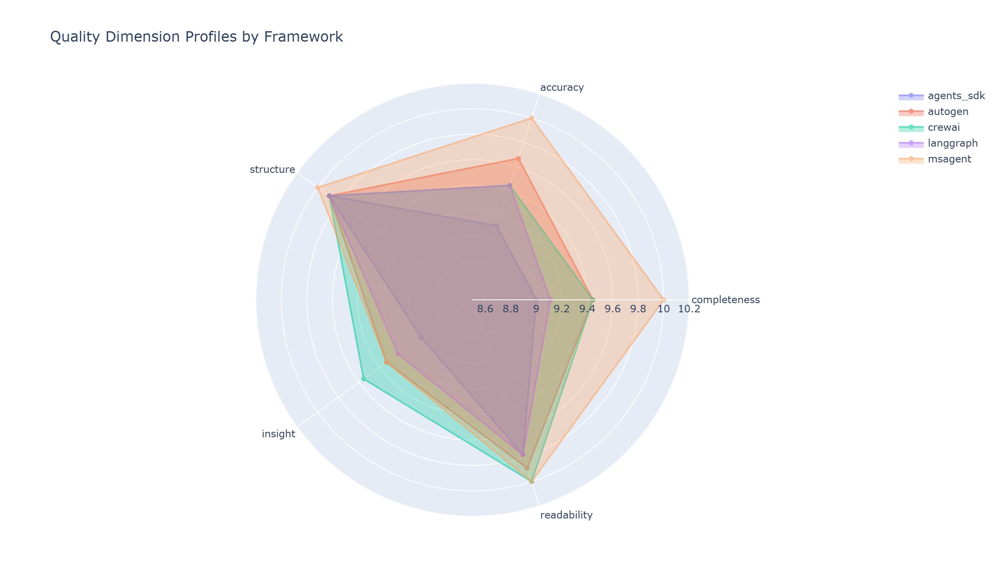
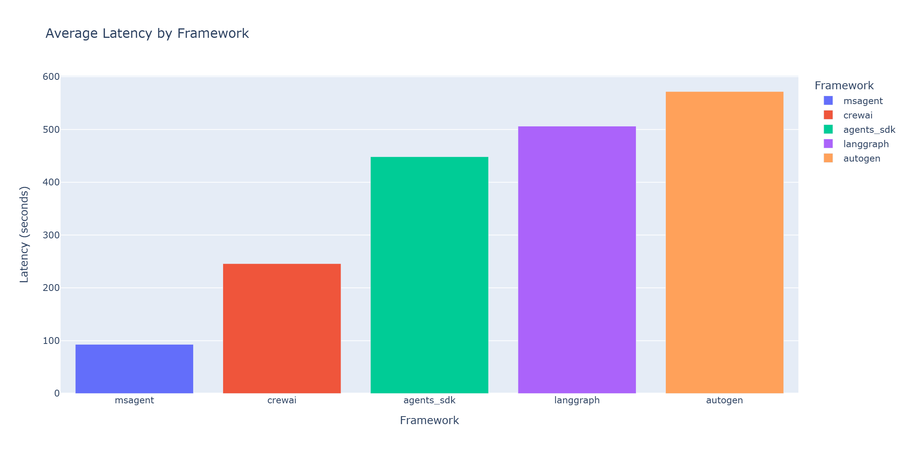
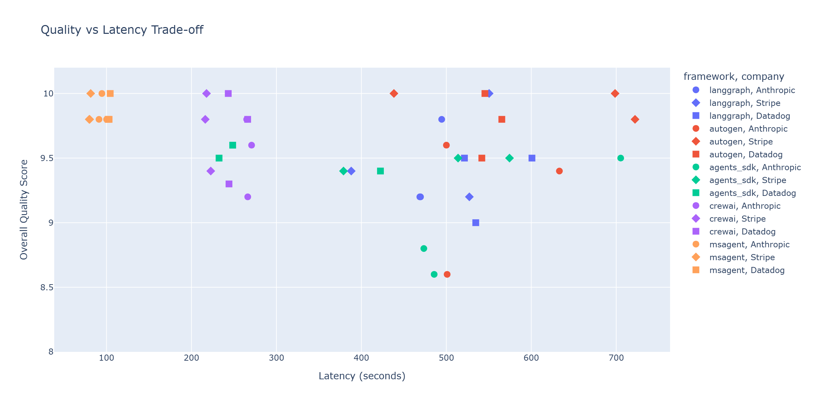

# I Benchmarked 5 AI Agent Frameworks — Here's What Actually Matters

I ran 45 benchmarks across 5 agent frameworks expecting a clear winner. The answer wasn't what I expected.

---

Everyone building with LLM agents in 2026 faces the same question: which framework should I use? Blog posts give you vibes. Docs give you cherry-picked examples. Twitter threads give you hot takes from people who tried one framework for a weekend.

I wanted numbers. Real numbers, from a controlled experiment.

So I built the same multi-agent workflow — a Company Research Agent — in five different frameworks, ran each one 9 times (3 companies x 3 iterations), scored every output with an LLM judge, and tracked latency and token usage down to the request level. Forty-five runs total, same model, same prompts, same evaluation criteria. No cloud APIs, no variable pricing confounding the results — everything running locally on the same machine.

Here's what the data actually says.

## The Setup

Five frameworks, each implementing the same three-agent pipeline:

1. **Researcher** — gathers raw information about a company
2. **Analyst** — synthesizes findings into structured insights
3. **Writer** — produces a polished research report

The frameworks:

- **LangGraph 1.0.x** — graph-based state machine with explicit node/edge definitions
- **CrewAI 1.9.x** — task-based sequential orchestration with role-playing agents
- **AutoGen 0.7.x** — async group chat where agents collaborate via messages
- **MS Agent Framework 1.0.0b** — sequential orchestration with built-in tool routing
- **OpenAI Agents SDK** — runner-based pipeline with handoff semantics

All five ran against the same local model (Qwen 3 14B via Ollama) with `temperature=0` for reproducibility. The target companies — Anthropic, Stripe, and Datadog — were chosen to represent different levels of public information availability: a well-documented public company, a high-profile private company, and a mid-profile enterprise player. Each framework researched all three, three times each.

The LLM judge evaluated each output report on five dimensions: completeness, accuracy, structure, insight depth, and readability — each scored 1-10, then combined into an overall quality score.

Why does this matter in 2026? Because agent frameworks have matured past the "hello world" phase. The question is no longer "can I build a multi-agent system?" — it's "which framework gives me the best tradeoff between quality, speed, cost, and reliability for production workloads?" I picked a company research pipeline because it's complex enough to stress-test orchestration (three agents with dependencies) but simple enough that the results are easy to evaluate objectively.

## Quality Results: Closer Than You'd Think

Here's the part that surprised me most. Look at this radar chart:

Every framework scores above 9.0 overall. The total spread from best to worst is just 0.56 points. Here are the full numbers:

| Framework | Quality | Completeness | Accuracy | Structure | Insight | Readability |
|-----------|---------|--------------|----------|-----------|---------|-------------|
| MS Agent | 9.87 | 10.00 | 10.00 | 10.00 | 9.33 | 10.00 |
| CrewAI | 9.66 | 9.44 | 9.44 | 9.89 | 9.56 | 10.00 |
| AutoGen | 9.63 | 9.44 | 9.67 | 9.89 | 9.33 | 9.89 |
| LangGraph | 9.42 | 9.11 | 9.44 | 9.89 | 9.22 | 9.78 |
| Agents SDK | 9.31 | 9.00 | 9.11 | 9.89 | 9.00 | 9.78 |

MS Agent Framework sits at the top with a near-perfect 9.87. Agents SDK comes in last at 9.31. But here's the thing — 9.31 is still *excellent*. When your worst performer is scoring above 9 out of 10, quality isn't the axis that differentiates these tools.

The radar chart tells the same story visually: all five polygons overlap heavily. Structure and readability are essentially identical across the board (everyone's above 9.78). The only dimension with meaningful separation is completeness, where MS Agent's perfect 10.00 pulls away from Agents SDK's 9.00.

## What Actually Differentiates Them

If quality is a wash, what should you care about? Three things: **speed**, **token cost**, and **consistency**.

### Speed: A 6x Gap

This is where the differences get dramatic. Average end-to-end latency per run:

- **MS Agent Framework**: 93s
- **CrewAI**: 246s
- **Agents SDK**: 448s
- **LangGraph**: 506s
- **AutoGen**: 572s

That's a **6x gap** between fastest and slowest. MS Agent finishes in a minute and a half while AutoGen is still grinding away at nearly ten minutes. For a batch job researching 100 companies, that's the difference between 2.5 hours and 16 hours.

CrewAI lands in a comfortable middle ground at ~4 minutes — fast enough for interactive use, efficient enough for batch processing. LangGraph and Agents SDK cluster together in the 7-8 minute range.

AutoGen's async group chat pattern, while flexible, introduces significant coordination overhead that shows up directly in wall-clock time. The agents exchange messages in a round-robin style, and each message round requires a full LLM call to decide whether to continue the conversation or hand off. That flexibility is powerful for open-ended collaboration, but for a linear pipeline like this one, it's overhead without payoff.

### Token Cost: 3x Difference

Not all frameworks are equally efficient with their LLM calls. Average total tokens per run:

- **Agents SDK**: 8,676 tokens
- **LangGraph**: 8,823 tokens
- **AutoGen**: 10,793 tokens
- **CrewAI**: 27,684 tokens

CrewAI uses **3.2x more tokens** than Agents SDK to produce comparable quality output. At local Ollama pricing, this is free. At GPT-4o pricing ($2.50/1M input, $10/1M output), that's the difference between ~$0.07 and ~$0.22 per run. Scale to thousands of runs per day and the gap matters.

Why such a spread? CrewAI's role-playing approach includes verbose system prompts and inter-agent communication that inflates token counts. Agents SDK and LangGraph take a leaner approach with minimal framing overhead.

*(Note: MS Agent Framework's beta release didn't expose token tracking, so it's excluded from this comparison.)*

### Consistency: The Hidden Variable

Average scores hide variance. Here's what the consistency numbers reveal:

| Framework | Std Dev | Min Score | Max Score | Range |
|-----------|---------|-----------|-----------|-------|
| MS Agent | 0.10 | 9.8 | 10.0 | 0.2 |
| CrewAI | 0.30 | 9.2 | 10.0 | 0.8 |
| LangGraph | 0.32 | 9.0 | 10.0 | 1.0 |
| Agents SDK | 0.36 | 8.6 | 9.6 | 1.0 |
| AutoGen | 0.45 | 8.6 | 10.0 | 1.4 |

MS Agent is remarkably tight — std dev of 0.10, range of just 0.2 points. Every single run scored between 9.8 and 10.0. You know exactly what you're going to get.

AutoGen is the opposite story. It can hit a perfect 10.0, but it can also drop to 8.6 — a 1.4-point range. A standard deviation of 0.45 means roughly one in three runs will deviate noticeably from the mean. If you're building a production pipeline where predictability matters (and it always does), this variance is a real concern. You'd need to build retry logic or output validation around it, which adds complexity.

What drives the inconsistency? I suspect it's the group chat architecture. When agents negotiate via messages, the conversation can take different paths depending on subtle phrasing differences in early turns, even with `temperature=0`. Sequential pipelines like MS Agent's don't have this branching problem — each agent gets a fixed input and produces a fixed output.

## Statistical Reality Check

Eyeballing averages is one thing. Let's see what the statistics actually support.

**Kruskal-Wallis test on quality scores: p = 0.005.** Statistically significant — differences between frameworks do exist. But that's the omnibus test. It tells you *something* differs, not *what*.

Pairwise Mann-Whitney U tests with Bonferroni correction (10 comparisons, corrected alpha = 0.005) tell a more nuanced story:

**Only one pair shows a statistically significant quality difference: Agents SDK vs MS Agent (p = 0.0003, effect size r = 0.86 — large).**

Every other pairwise comparison — LangGraph vs CrewAI, AutoGen vs Agents SDK, CrewAI vs MS Agent, all of them — fails to reach significance after correction. The apparent quality differences between most frameworks are **indistinguishable from noise** at this sample size.

Now compare that to latency. **Kruskal-Wallis test on latency: p = 0.000001.** The speed differences are extremely real and not going away with more data.

**Translation: don't pick your framework based on quality. Pick based on speed, cost, and consistency.**

The scatter plot drives this home. Quality clusters tightly between 8.6 and 10.0 regardless of framework, while latency sprawls from 80 seconds to over 700. The vertical axis is noise. The horizontal axis is signal.

This is the single most important finding from this benchmark: **all five frameworks produce excellent output when given the same model and prompts.** The framework is the orchestration layer, not the intelligence layer. The model does the heavy lifting. The framework's job is to get out of the way efficiently — and that's where the real differences emerge.

## The Ranking

Putting it all together:

| Framework | Quality | Latency (s) | Tokens | Consistency (std) |
|-----------|---------|-------------|--------|-------------------|
| MS Agent | 9.87 | 93 | N/A* | 0.10 |
| CrewAI | 9.66 | 246 | 27,684 | 0.30 |
| AutoGen | 9.63 | 572 | 10,793 | 0.45 |
| LangGraph | 9.42 | 506 | 8,823 | 0.32 |
| Agents SDK | 9.31 | 448 | 8,676 | 0.36 |

*\*MS Agent Framework beta didn't expose token tracking.*

MS Agent dominates on quality, speed, and consistency — but it's a 1.0.0 beta release with limited token observability and a smaller ecosystem. If you're comfortable betting on a newer framework, it's compelling. If you need production maturity and community support today, that's a different calculation.

CrewAI is the pragmatic middle ground: fast enough, high quality, reasonable consistency, and the most intuitive API of the bunch. The token cost is the tax you pay for its role-playing architecture. For most teams, that tradeoff is worth it.

AutoGen produces great output but slowly and unpredictably. Its group chat pattern shines for open-ended agent collaboration — just not for structured pipelines.

LangGraph and Agents SDK are solid workhorses with lean token usage. LangGraph gives you the most control over execution flow (it's a state machine, after all), while Agents SDK keeps things simple with minimal boilerplate. Both pay for that simplicity with longer execution times.

There's no single winner. There's a set of tradeoffs, and the right choice depends on what you're optimizing for.

## What's Next

This article covered the *what*. The next two in this series cover the *how* and the *so what*:

- **Part 2: How I Built a Fair Benchmark** — The methodology behind controlled comparisons: same prompts, same model, LLM-as-judge evaluation, and the dependency hell of installing five frameworks that don't want to coexist.
- **Part 3: A Practical Decision Guide** — Flowchart for picking the right framework based on your actual constraints: team size, latency budget, cost sensitivity, and how much you value consistency.

---

*Built with Python 3.12, uv, Ollama (Qwen 3 14B), and too many hours debugging dependency conflicts between frameworks that each want their own version of the OpenAI SDK.*

*All code, data, and analysis notebooks are open source: [agent-framework-benchmark](https://github.com/LukaszGrochal/agent-framework-benchmark)*
