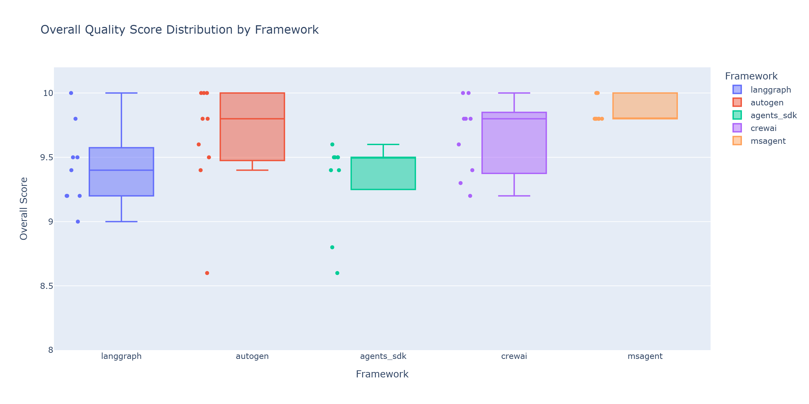
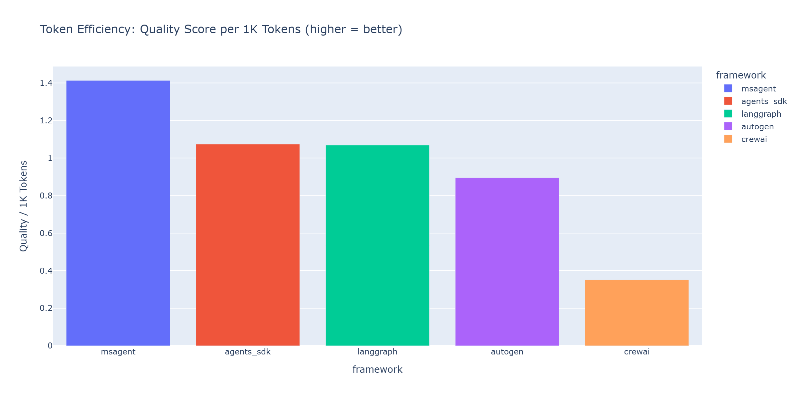
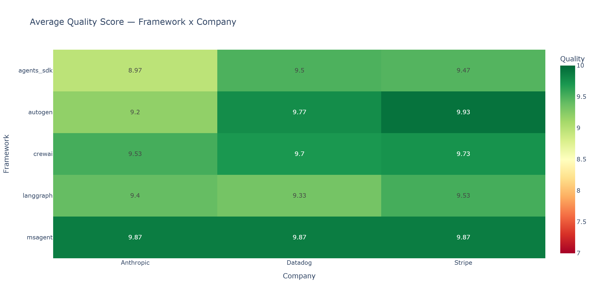

# Choosing an Agent Framework in 2026: A Data-Driven Decision Guide

You've seen the benchmarks. You've read the methodology. Now the question that actually matters: which one should YOU use?

---

I spent weeks building the same multi-agent workflow in five frameworks, running 45 controlled benchmarks, and analyzing every dimension I could measure. The full results are in [Part 1](./01-benchmark-results.md) and the methodology is in [Part 2](./02-benchmark-methodology.md). This article distills all of that into actionable guidance.

## The Short Answer

There is no single "best" framework. If someone tells you otherwise, they're either selling something or they only evaluated one dimension. The right choice depends on what you're optimizing for.

Here's the decision matrix:

| Your Priority | Best Choice | Why (Data) |
|--------------|-------------|------------|
| Fastest prototype | CrewAI | Simplest API, 246s latency, 9.66 quality |
| Production stability | LangGraph | 1.0 GA, graph-based control, 9.42 quality |
| Raw speed | MS Agent Framework | 93s latency (6x faster), 9.87 quality |
| Microsoft/Azure ecosystem | MS Agent Framework | Ecosystem integration, successor to AutoGen + Semantic Kernel |
| OpenAI-native apps | Agents SDK | Tightest OpenAI integration, built-in tracing |
| Lowest token cost | Agents SDK | 8,676 tokens/run (vs CrewAI's 27,684) |
| Most consistent output | MS Agent Framework | Std=0.10, range=0.2 (narrowest) |

If you already know your top constraint, that table might be all you need. If you want to understand the tradeoffs in depth, keep reading.

## Factor 1: Consistency Matters More Than Average Score

This is the finding I keep coming back to. Everyone focuses on mean quality scores, but variance is what bites you in production.

Think about it this way: if a framework averages 9.6 but occasionally drops to 8.6, you need retry logic, output validation, and fallback handling. If another framework averages 9.87 and never drops below 9.8, you can trust it and move on.

| Framework | Mean | Std Dev | Min | Max | Range |
|-----------|------|---------|-----|-----|-------|
| MS Agent | 9.87 | 0.10 | 9.8 | 10.0 | 0.2 |
| CrewAI | 9.66 | 0.30 | 9.2 | 10.0 | 0.8 |
| LangGraph | 9.42 | 0.32 | 9.0 | 10.0 | 1.0 |
| Agents SDK | 9.31 | 0.36 | 8.6 | 9.6 | 1.0 |
| AutoGen | 9.63 | 0.45 | 8.6 | 10.0 | 1.4 |

MS Agent Framework's consistency is remarkable. A standard deviation of 0.10 means virtually every run lands in the same narrow band. AutoGen sits at the other end with a 1.4-point range and a std dev of 0.45 -- meaning roughly one in three runs deviates noticeably from the mean.

Why does this happen? Architecture. Sequential pipelines (MS Agent) produce deterministic data flow: each agent gets a fixed input and produces a fixed output. Group chat patterns (AutoGen) introduce conversational branching where subtle phrasing differences in early turns cascade into meaningfully different outputs, even at `temperature=0`.

If you're building a pipeline that runs unattended -- batch processing, scheduled reports, automated analysis -- consistency should be your top priority. A framework that's slightly lower in average quality but tighter in variance will cause fewer 3am pages than one that's higher on average but occasionally produces garbage.

## Factor 2: Token Cost at Scale

When running locally via Ollama, tokens are free. The moment you deploy to a cloud model, they're your biggest variable cost.

Here's what each framework costs at GPT-4o rates ($2.50/1M input, $10/1M output, assuming a roughly 40/60 input/output split):

| Framework | Tokens/Run | Approx Cost/Run | 1,000 runs/month |
|-----------|-----------|-----------------|-------------------|
| Agents SDK | 8,676 | ~$0.07 | ~$70 |
| LangGraph | 8,823 | ~$0.07 | ~$70 |
| AutoGen | 10,793 | ~$0.09 | ~$90 |
| CrewAI | 27,684 | ~$0.22 | ~$220 |

*(MS Agent Framework's beta didn't expose token tracking, so it's excluded.)*

CrewAI uses 3.2x more tokens than the leanest frameworks. That's the cost of its role-playing architecture -- verbose system prompts and inter-agent communication inflate every run. At $220/month for 1,000 runs, it's still reasonable. But scale to 10,000 runs and you're looking at $2,200 vs $700. That delta funds an engineer for a week.

Agents SDK and LangGraph are essentially tied at ~8,700 tokens per run. If token cost is your binding constraint and you have no other strong preferences, either of these is a safe bet.

## Factor 3: Production Readiness

Raw benchmark numbers don't capture maturity. A framework that tops every metric doesn't help you if it ships breaking changes every two weeks or has no documentation for your edge case. Here's my honest tiered assessment:

**Tier 1 -- Production Ready**
- **LangGraph 1.0** -- The only 1.0 GA release in this comparison. Graph-based architecture gives you explicit control over execution flow. Largest community, most Stack Overflow answers, best debugging and observability tools. If something goes wrong at 2am, you'll find help.

**Tier 2 -- Stable, Active Development**
- **CrewAI 1.9** -- Rapidly evolving with good documentation and an intuitive API. Some API churn between minor versions, so pin your dependencies carefully. The ecosystem is smaller than LangGraph's but growing fast.
- **Agents SDK** -- OpenAI-backed with a stable API surface. Tightly coupled to OpenAI's ecosystem, which is either a feature or a lock-in risk depending on your perspective. Built-in tracing is a genuine production advantage.

**Tier 3 -- Use with Caution**
- **AutoGen 0.7** -- Effectively in maintenance mode. Microsoft's engineering energy is flowing into MS Agent Framework. The group chat architecture is genuinely powerful for open-ended collaboration, but if you're starting a new project today, you're building on a platform that's being superseded.

**Tier 4 -- High Potential, Not GA**
- **MS Agent Framework 1.0.0b** -- Topped every metric in the benchmark: quality, speed, and consistency. But it's a beta release with GA expected around March 2026. The API surface could change. Documentation is thin. Community support is minimal. If you can absorb that risk, the numbers are compelling. If you need stability guarantees today, wait two months.

## Factor 4: Architecture Style

Each framework embodies a different mental model for agent orchestration. Picking one that matches how you think about your problem will save you more time than any benchmark number.

**Graph-based (LangGraph)** -- You define nodes (agents, functions) and edges (transitions, conditions). Execution follows the graph. Best for workflows with branching logic, conditional routing, or cycles. If you think in flowcharts, you'll feel at home.

**Task-based (CrewAI)** -- You define tasks with descriptions and assign them to agents with roles. The framework handles sequencing. Lowest boilerplate of the five. Best for quick prototypes and linear pipelines where you don't need fine-grained control over agent interaction.

**Group chat (AutoGen)** -- Agents communicate via a shared message stream, taking turns based on selection logic. Most flexible for open-ended collaboration where you don't know the conversation shape in advance. Worst for structured pipelines where that flexibility becomes overhead.

**Sequential (MS Agent Framework)** -- A clean pipeline where each agent processes input and passes output to the next. Simple mental model, predictable execution, easy to debug. Best when your workflow is a straight line from input to output.

**Runner-based (Agents SDK)** -- A runner executes an agent, which can hand off to other agents. Lightweight abstraction with built-in tracing and OpenAI ecosystem integration. Best when you're already deep in the OpenAI stack and want minimal friction.

## My Recommendation

I'll be opinionated here because vague advice is useless advice. These are my recommendations based on the data, tempered by practical experience:

**Starting a production system today? LangGraph.**
It's the only 1.0 GA framework in this comparison. The graph-based architecture scales to complex workflows. The community and tooling ecosystem are mature. Quality is solid at 9.42, and while it's not the fastest (506s) or cheapest in tokens, it has the most predictable upgrade path. You won't regret this choice in six months.

**Prototyping fast? CrewAI.**
If you need a working multi-agent system by Friday, CrewAI's API is the fastest path from zero to demo. Define roles, assign tasks, run. Accept the 3x token overhead as the cost of velocity. You can always migrate later if the token cost becomes a problem at scale.

**Can wait two months? MS Agent Framework.**
The benchmark numbers are remarkable: fastest latency by 2.5x, highest quality, tightest consistency. If the GA release delivers on the beta's promise, this becomes the default recommendation. Watch the March 2026 release closely.

**Already in the OpenAI ecosystem? Agents SDK.**
Don't fight your stack. If you're using OpenAI models, OpenAI's function calling, and OpenAI's tooling, the Agents SDK integrates most naturally. Lowest token cost, built-in tracing, clean handoff semantics. The coupling to OpenAI is the obvious tradeoff -- if you ever need to switch providers, you'll be rewriting.

## Get the Data

Everything behind this analysis is open source. Run the benchmarks yourself, challenge my numbers, extend the comparison to new frameworks or tasks.

- **GitHub**: [agent-framework-benchmark](https://github.com/LukaszGrochal/agent-framework-benchmark)
- **Analysis notebook**: `notebooks/analysis.ipynb` -- all charts, tables, and statistical tests
- **Raw data**: `results/benchmark_results.csv` -- 45 runs, every metric

Clone it, install with `uv sync`, and run `uv run python -m benchmark.runner`. If you find different results, I want to hear about it.

## Series Navigation

- **Part 1: [I Benchmarked 5 AI Agent Frameworks -- Here's What Actually Matters](./01-benchmark-results.md)** -- The results: quality, latency, tokens, and consistency across 45 runs.
- **Part 2: [How I Built a Fair AI Agent Benchmark](./02-benchmark-methodology.md)** -- Architecture, methodology, and the engineering behind controlled comparisons.
- **Part 3: Choosing an Agent Framework in 2026** -- You are here. The decision guide.

---

*Built with Python 3.12, uv, Ollama (Qwen 3 14B), and 45 runs of hard data. Pick a framework, ship something, and remember: the model does the thinking. The framework just gets out of the way.*
